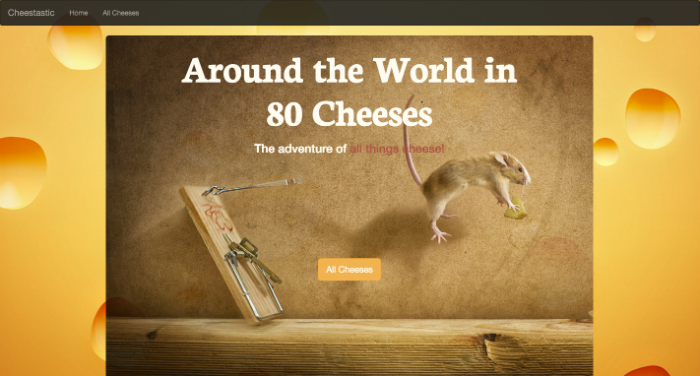

<h2> Around the World in 80 Cheeses</h2>
**If there ever were a pure passion project this would be it.**
**I love cheese, unequivocally, love it. This project is a work in progress in dedication to my love**

<h3>Technology used</h3>
<ul>
  <li>My own API backend</li>
  <li>Mongo, Mongoose, Express, Node
  <li>Angular- UI Router, ngResource
  <li>HTML/CSS/Bootstrap
</ul>

<h3>Features</h3>
**Users have the ability to add, edit and delete their favorite cheeses, creating a curated collection
of the best cheeses of the world. Also included is information regarding:**
  <li>Type of cheese</li>
  <li>Country and region of origin</li>
  <li>Star rating</li>
  <li>Description and image</li>
  
<h3>Future features</h3>
<li>Index by country and cheese types</li>
<li>Inclusion of recipes</li>
<li>World map</li>
